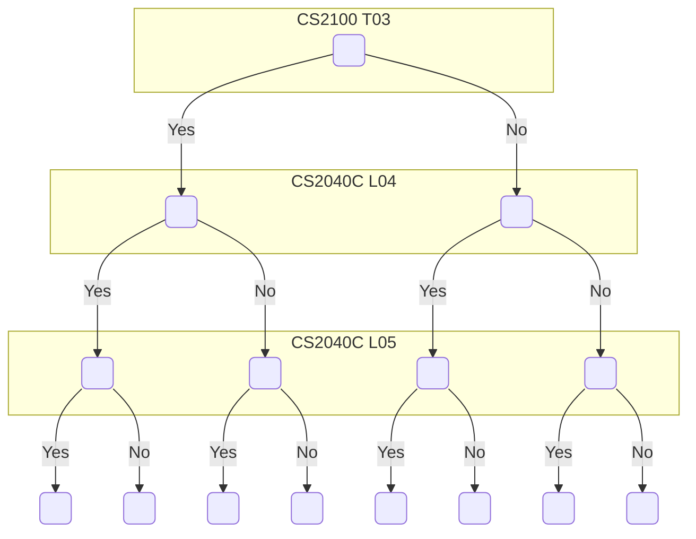

# Solver

## Input/Output

Output is the same as input with a few missing mods

```json
[
    // User 1
    [
        {
            "moduleCode": "CS2040C",
            "lessonType": "Lecture",
            "classNo": "01",
            "startTime": "0900",
            "endTime": "1000",
            "day": "Monday",
            ... // Any other keys
        },
        {
            "moduleCode": "CS2040C",
            "lessonType": "Laboratory",
            "classNo": "L04",
            "startTime": "0900",
            "endTime": "1000",
            "day": "Tuesday",
        }
    ],

    // User 2
    [
        {
            "moduleCode": "CS2040C",
            "lessonType": "Lecture",
            "classNo": "01",
            "startTime": "0900",
            "endTime": "1000",
            "day": "Monday",
        }
    ]
]
```

## Usage

```js
import { getOptimisedTimetable } from "solver";

getOptimisedTimetable(
  timetables, // Object defined above
  1, // Index of the current user (with respect to the array above)
  5, // Max # of solutions
);
```

## Algorithm Description

Exhaustive Search


